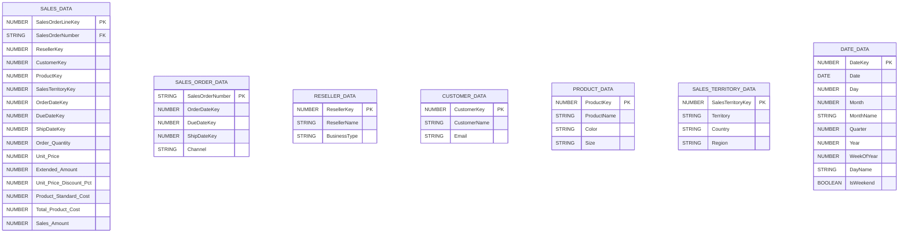

```mermaid
erDiagram
    SALES_DATA {
      NUMBER  SalesOrderLineKey PK
      STRING  SalesOrderNumber FK
      NUMBER  ResellerKey
      NUMBER  CustomerKey
      NUMBER  ProductKey
      NUMBER  SalesTerritoryKey
      NUMBER  OrderDateKey
      NUMBER  DueDateKey
      NUMBER  ShipDateKey
      NUMBER  Order_Quantity
      NUMBER  Unit_Price
      NUMBER  Extended_Amount
      NUMBER  Unit_Price_Discount_Pct
      NUMBER  Product_Standard_Cost
      NUMBER  Total_Product_Cost
      NUMBER  Sales_Amount
    }

    SALES_ORDER_DATA {
      STRING  SalesOrderNumber PK
      NUMBER  OrderDateKey
      NUMBER  DueDateKey
      NUMBER  ShipDateKey
      STRING  Channel
    }

    RESELLER_DATA {
      NUMBER  ResellerKey PK
      STRING  ResellerName
      STRING  BusinessType
    }

    CUSTOMER_DATA {
      NUMBER  CustomerKey PK
      STRING  CustomerName
      STRING  Email
    }

    PRODUCT_DATA {
      NUMBER  ProductKey PK
      STRING  ProductName
      STRING  Color
      STRING  Size
    }

    SALES_TERRITORY_DATA {
      NUMBER  SalesTerritoryKey PK
      STRING  Territory
      STRING  Country
      STRING  Region
    }

    DATE_DATA {
      NUMBER  DateKey PK
      DATE    Date
      NUMBER  Day
      NUMBER  Month
      STRING  MonthName
      NUMBER  Quarter
      NUMBER  Year
      NUMBER  WeekOfYear
      STRING  DayName
      BOOLEAN IsWeekend
    }
``` 