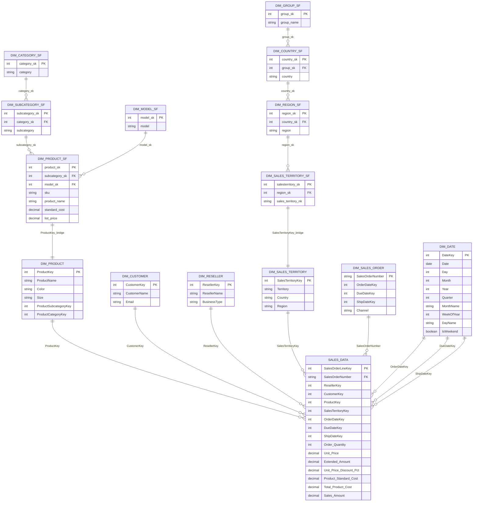

```mermaid
erDiagram
    %% NOTE: DIM_PRODUCT_SF.model_sk is nullable

    %% Product hierarchy (snowflaked)
    DIM_CATEGORY_SF        ||--o{ DIM_SUBCATEGORY_SF       : category_sk
    DIM_SUBCATEGORY_SF     ||--o{ DIM_PRODUCT_SF           : subcategory_sk
    DIM_MODEL_SF           ||--o{ DIM_PRODUCT_SF           : model_sk
    DIM_PRODUCT_SF         ||--|| DIM_PRODUCT              : ProductKey_bridge

    %% Territory hierarchy (snowflaked)
    DIM_GROUP_SF           ||--o{ DIM_COUNTRY_SF           : group_sk
    DIM_COUNTRY_SF         ||--o{ DIM_REGION_SF            : country_sk
    DIM_REGION_SF          ||--o{ DIM_SALES_TERRITORY_SF   : region_sk
    DIM_SALES_TERRITORY_SF ||--|| DIM_SALES_TERRITORY      : SalesTerritoryKey_bridge

    %% Fact relationships (natural/business keys)
    DIM_PRODUCT            ||--o{ SALES_DATA               : ProductKey
    DIM_CUSTOMER           ||--o{ SALES_DATA               : CustomerKey
    DIM_RESELLER           ||--o{ SALES_DATA               : ResellerKey
    DIM_SALES_TERRITORY    ||--o{ SALES_DATA               : SalesTerritoryKey
    DIM_SALES_ORDER        ||--o{ SALES_DATA               : SalesOrderNumber
    DIM_DATE               ||--o{ SALES_DATA               : OrderDateKey
    DIM_DATE               ||--o{ SALES_DATA               : DueDateKey
    DIM_DATE               ||--o{ SALES_DATA               : ShipDateKey

    SALES_DATA {
        int      SalesOrderLineKey PK
        string   SalesOrderNumber FK
        int      ResellerKey
        int      CustomerKey
        int      ProductKey
        int      SalesTerritoryKey
        int      OrderDateKey
        int      DueDateKey
        int      ShipDateKey
        int      Order_Quantity
        decimal  Unit_Price
        decimal  Extended_Amount
        decimal  Unit_Price_Discount_Pct
        decimal  Product_Standard_Cost
        decimal  Total_Product_Cost
        decimal  Sales_Amount
    }

    DIM_CATEGORY_SF {
        int     category_sk PK
        string  category
    }
    DIM_SUBCATEGORY_SF {
        int     subcategory_sk PK
        int     category_sk FK
        string  subcategory
    }
    DIM_MODEL_SF {
        int     model_sk PK
        string  model
    }
    DIM_PRODUCT_SF {
        int     product_sk PK
        int     subcategory_sk FK
        int     model_sk FK
        string  sku
        string  product_name
        decimal standard_cost
        decimal list_price
    }

    DIM_GROUP_SF {
        int     group_sk PK
        string  group_name
    }
    DIM_COUNTRY_SF {
        int     country_sk PK
        int     group_sk FK
        string  country
    }
    DIM_REGION_SF {
        int     region_sk PK
        int     country_sk FK
        string  region
    }
    DIM_SALES_TERRITORY_SF {
        int     salesterritory_sk PK
        int     region_sk FK
        string  sales_territory_nk
    }

    DIM_PRODUCT {
        int     ProductKey PK
        string  ProductName
        string  Color
        string  Size
        int     ProductSubcategoryKey
        int     ProductCategoryKey
    }

    DIM_SALES_TERRITORY {
        int     SalesTerritoryKey PK
        string  Territory
        string  Country
        string  Region
    }

    DIM_CUSTOMER {
        int     CustomerKey PK
        string  CustomerName
        string  Email
    }

    DIM_RESELLER {
        int     ResellerKey PK
        string  ResellerName
        string  BusinessType
    }

    DIM_SALES_ORDER {
        string  SalesOrderNumber PK
        int     OrderDateKey
        int     DueDateKey
        int     ShipDateKey
        string  Channel
    }

    DIM_DATE {
        int     DateKey PK
        date    Date
        int     Day
        int     Month
        int     Year
        int     Quarter
        string  MonthName
        int     WeekOfYear
        string  DayName
        boolean IsWeekend
    }
```