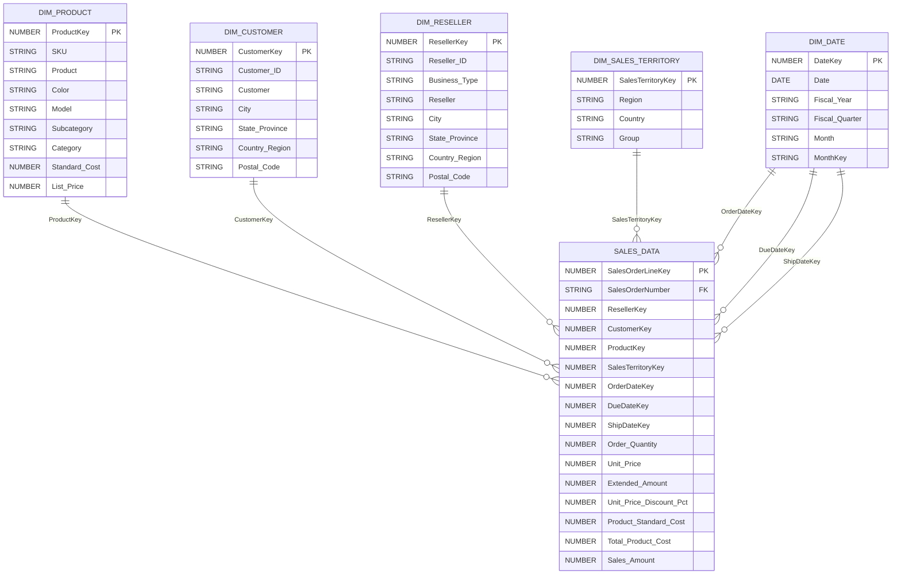

```mermaid
erDiagram
  DIM_PRODUCT         ||--o{ SALES_DATA : "ProductKey"
  DIM_CUSTOMER        ||--o{ SALES_DATA : "CustomerKey"
  DIM_RESELLER        ||--o{ SALES_DATA : "ResellerKey"
  DIM_SALES_TERRITORY ||--o{ SALES_DATA : "SalesTerritoryKey"
  DIM_DATE            ||--o{ SALES_DATA : "OrderDateKey"
  DIM_DATE            ||--o{ SALES_DATA : "DueDateKey"
  DIM_DATE            ||--o{ SALES_DATA : "ShipDateKey"

  SALES_DATA {
      NUMBER  SalesOrderLineKey PK
      STRING  SalesOrderNumber  FK
      NUMBER  ResellerKey
      NUMBER  CustomerKey
      NUMBER  ProductKey
      NUMBER  SalesTerritoryKey
      NUMBER  OrderDateKey
      NUMBER  DueDateKey
      NUMBER  ShipDateKey
      NUMBER  Order_Quantity
      NUMBER  Unit_Price
      NUMBER  Extended_Amount
      NUMBER  Unit_Price_Discount_Pct
      NUMBER  Product_Standard_Cost
      NUMBER  Total_Product_Cost
      NUMBER  Sales_Amount
  }

  DIM_PRODUCT { 
      NUMBER ProductKey PK
      STRING SKU
      STRING Product
      STRING Color
      STRING Model
      STRING Subcategory
      STRING Category
      NUMBER Standard_Cost
      NUMBER List_Price
  }

  DIM_CUSTOMER {
      NUMBER CustomerKey PK
      STRING Customer_ID
      STRING Customer
      STRING City
      STRING State_Province
      STRING Country_Region
      STRING Postal_Code
  }

  DIM_RESELLER {
      NUMBER ResellerKey PK
      STRING Reseller_ID
      STRING Business_Type
      STRING Reseller
      STRING City
      STRING State_Province
      STRING Country_Region
      STRING Postal_Code
  }

  DIM_SALES_TERRITORY {
      NUMBER SalesTerritoryKey PK
      STRING Region
      STRING Country
      STRING Group
  }

  DIM_DATE {
      NUMBER DateKey PK
      DATE   Date
      STRING Fiscal_Year
      STRING Fiscal_Quarter
      STRING Month
      STRING MonthKey
  }

```