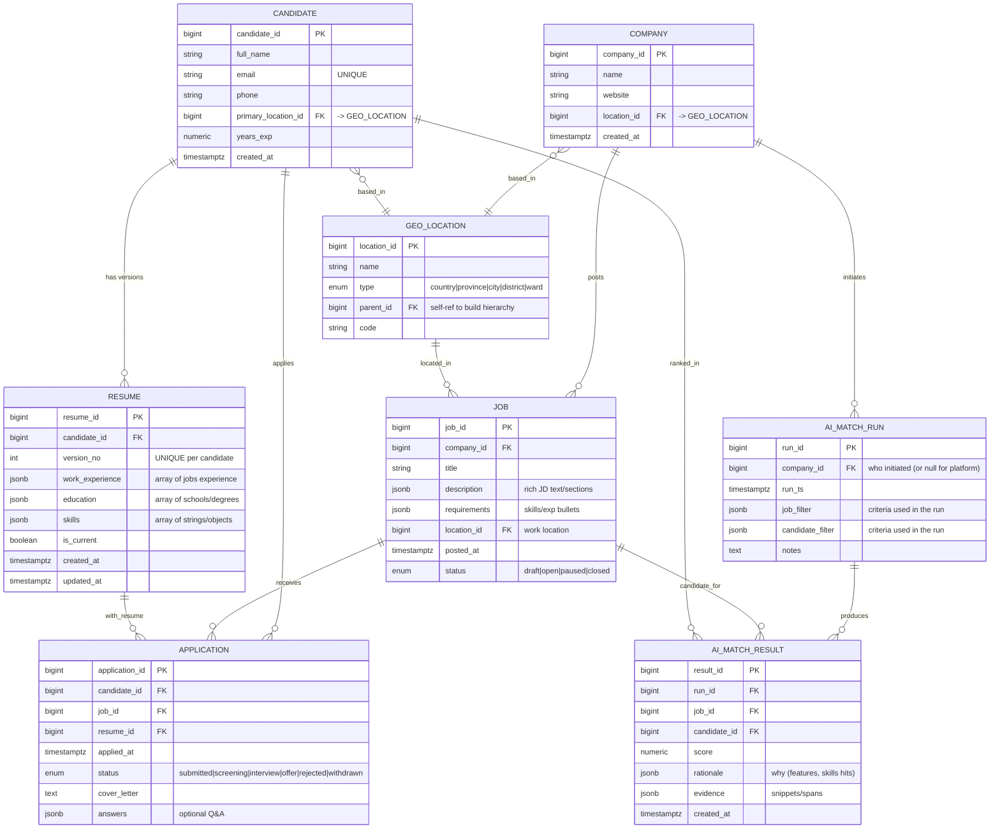

```mermaid
erDiagram
  GEO_LOCATION {
    bigint location_id PK
    string name
    enum type  "country|province|city|district|ward"
    bigint parent_id FK "self-ref to build hierarchy"
    string code
  }

  COMPANY {
    bigint company_id PK
    string name
    string website
    bigint location_id FK "-> GEO_LOCATION"
    timestamptz created_at
  }
  COMPANY }o--|| GEO_LOCATION : "based_in"

  CANDIDATE {
    bigint candidate_id PK
    string full_name
    string email "UNIQUE"
    string phone
    bigint primary_location_id FK "-> GEO_LOCATION"
    numeric years_exp
    timestamptz created_at
  }
  CANDIDATE }o--|| GEO_LOCATION : "based_in"

  RESUME {
    bigint resume_id PK
    bigint candidate_id FK
    int version_no "UNIQUE per candidate"
    jsonb work_experience "array of jobs experience"
    jsonb education       "array of schools/degrees"
    jsonb skills          "array of strings/objects"
    boolean is_current
    timestamptz created_at
    timestamptz updated_at
  }
  CANDIDATE ||--o{ RESUME : "has versions"

  JOB {
    bigint job_id PK
    bigint company_id FK
    string title
    jsonb description     "rich JD text/sections"
    jsonb requirements    "skills/exp bullets"
    bigint location_id FK "work location"
    timestamptz posted_at
    enum status "draft|open|paused|closed"
  }
  COMPANY ||--o{ JOB : "posts"
  GEO_LOCATION ||--o{ JOB : "located_in"

  APPLICATION {
    bigint application_id PK
    bigint candidate_id FK
    bigint job_id FK
    bigint resume_id FK
    timestamptz applied_at
    enum status "submitted|screening|interview|offer|rejected|withdrawn"
    text cover_letter
    jsonb answers "optional Q&A"
  }
  CANDIDATE ||--o{ APPLICATION : "applies"
  JOB ||--o{ APPLICATION : "receives"
  RESUME ||--o{ APPLICATION : "with_resume"

  AI_MATCH_RUN {
    bigint run_id PK
    bigint company_id FK "who initiated (or null for platform)"
    timestamptz run_ts
    jsonb job_filter        "criteria used in the run"
    jsonb candidate_filter  "criteria used in the run"
    text notes
  }
  COMPANY ||--o{ AI_MATCH_RUN : "initiates"

  AI_MATCH_RESULT {
    bigint result_id PK
    bigint run_id FK
    bigint job_id FK
    bigint candidate_id FK
    numeric score
    jsonb rationale   "why (features, skills hits)"
    jsonb evidence    "snippets/spans"
    timestamptz created_at
  }
  AI_MATCH_RUN ||--o{ AI_MATCH_RESULT : "produces"
  JOB ||--o{ AI_MATCH_RESULT : "candidate_for"
  CANDIDATE ||--o{ AI_MATCH_RESULT : "ranked_in"

```